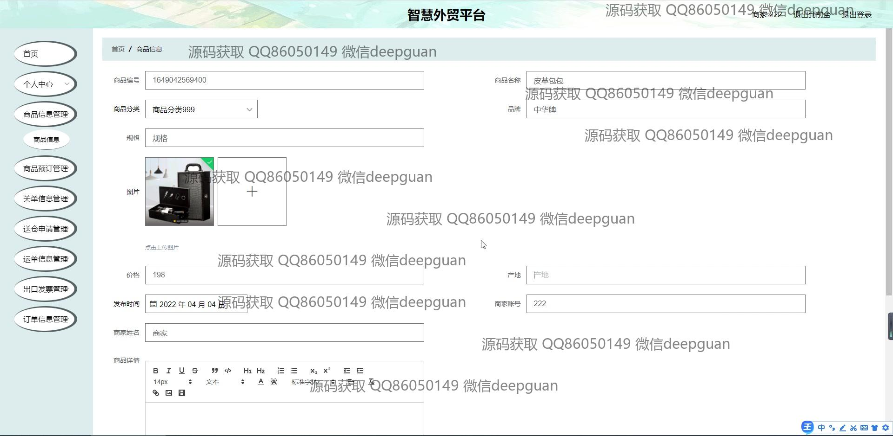
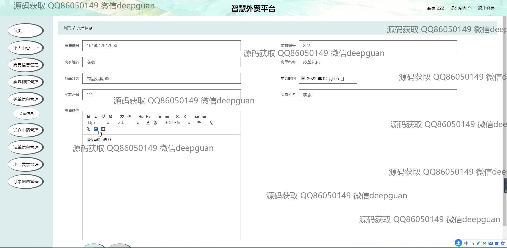
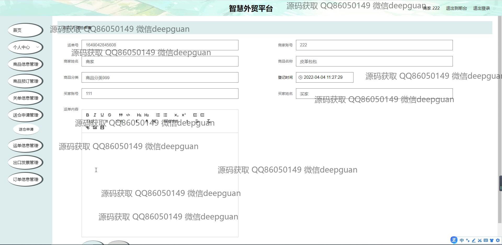

<h1 align="center">智慧外贸平台</h1>

## 简介
智慧外贸平台：提供管理员和用户两种角色，具备商品信息管理、订单管理、用户注册登录、公告资讯、及发票和关单信息管理等功能，简化外贸操作流程，提高效率。    --计算机毕业设计源码；毕设源码；java毕业设计源码

## 联系方式

<h3 align="center">获取完整代码与数据库文件 + 微信：deepguan QQ: 86050149 QQ群: 783742310</h3>

<h3 align="center">可帮忙远程部署 包运行成功！提供远程部署、修改代码、设计文档指导、代码讲解等服务！</h3>

## 功能介绍（完整见运行截图）
管理员：基本功能包括登录、注册、退出等基本操作，维持网站的正常运作。平台首页设计简洁，带有主导航栏和便捷的搜索功能，便于用户快速定位所需模块。管理员可以管理商品信息，进行商品分类、添加、编辑及查看商品详情，确保商家信息完整和准确。订单管理是管理员的核心任务，涉及订单创建、编辑、审核及详情查看，旨在优化用户的订单处理体验。平台支持出口发票、关单信息和运单信息的全面管理，帮助管理员高效管理复杂的外贸交易流程。

商家：商家角色主要负责平台上的商品和订单信息。商家需通过登录界面进入平台，使用可选择的角色权限提升平台的安全性。商品信息管理是商家的重要职能，包括商品的录入、分类、编辑和更新，确保信息准确无误。商家可利用平台提供的工具进行订单详情编辑，并通过富文本编辑器添加备注，方便后续沟通和处理。商家还负责管理关单信息和审查送仓申请，确保物流和出口操作顺畅高效。

用户：用户角色包括登录和注册以便访问外贸平台，其中注册需输入必要的商家信息。用户可浏览商品详情，包括价格、产地、发布时间等，利用预订功能与商家进行互动。商品分类管理功能便于用户按需查找，增加了购物体验的便利性。个人中心提供信息查看与维护，用户可管理个人订单、编辑个人资料以保持数据的更新与准确。

操作员：操作员在外贸平台中承担行政管理职责。其主要工作包括系统的用户信息管理，确保注册用户的资料合规和安全；协助商家编辑和审核商品订单，维护信息的准确性和及时更新；处理出口发票和运单的录入与管理，通过平台工具优化信息流通，提升外贸操作的工作效率与透明度。

## 运行截图

本代码来源于网络,仅供学习参考使用!

